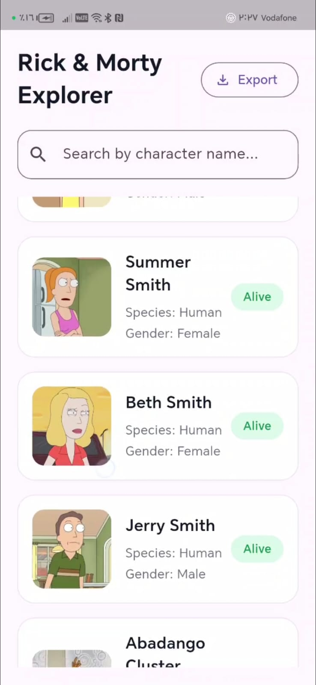
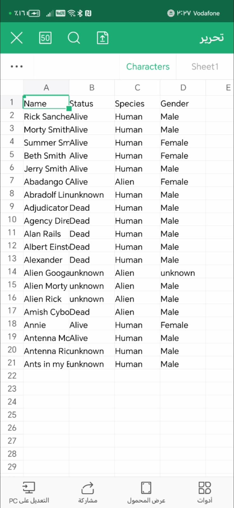

# Rick & Morty Flutter App

A Flutter application that displays characters from the Rick and Morty API.  
The app allows users to browse characters, search for specific characters, and view character details with a clean and organized UI.

## ✨ Features

- Display Rick & Morty characters
- Search characters by name
- View character information
- Export data to Excel file
- Responsive UI
- API integration using Dio & Retrofit
- State management using Cubit
- Clean Architecture structure

## 🛠️ Technologies Used

- Flutter
- Dart
- REST API
- Dio
- Retrofit
- Flutter Bloc / Cubit
- Clean Architecture
- Dependency Injection
- JSON Serialization

## 📸 Screenshots

### Home Screen



### Search


### Export Excel



## 🎥 Demo Video

[Watch the demo video](https://drive.google.com/file/d/1Yk1Skc9pq95I6wdKKvWPf6YtjFaMXqXL/view?usp=drive_link)

## 🚀 Getting Started

### Prerequisites

Make sure you have Flutter installed on your machine.

### Installation

Clone the repository:

```bash
git clone https://github.com/menna-ahmed123/rick-morty.git